# Review Modul 10 - Asynchronous Programming
## Tutorial 1: Timer
### Eksperimen 1.2: Understanding How it Works
#### Hasil Eksekusi Terminal
```text
hey hey
howdy!
done!

```
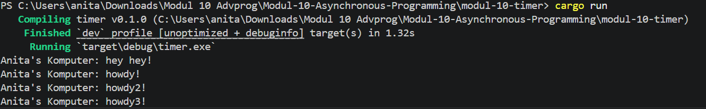

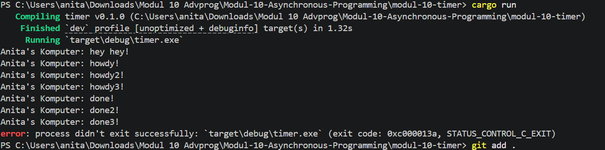

#### Analisis dan Penjelasan
Mengapa urutan keluaran yang muncul di terminal menjadi `hey hey` -> `howdy!` -> `done!`? Berikut adalah analisis fungsional mengenai alur eksekusi asinkronus tersebut:

1. **Sifat Non-blocking dari `spawner.spawn**`:
Ketika fungsi `spawner.spawn(...)` dipanggil, ia tidak langsung mengeksekusi blok kode asinkronus (`async block`) yang berada di dalamnya saat itu juga. Fungsi `spawn` ini hanya bertugas untuk membungkus kode tersebut menjadi sebuah *task* baru dan memasukkannya ke dalam antrean task (*task queue*) milik `Executor`. Setelah itu, alur program langsung melanjutkan eksekusi ke baris berikutnya tanpa menunggu (*non-blocking*). Oleh karena itu, perintah cetak teks baru (`hey hey`) yang diletakkan tepat di bawah `spawner.spawn` dieksekusi terlebih dahulu.
2. **Peran Alur Kendali `Executor**`:
Teks `howdy!` baru dicetak setelah alur kendali fungsi utama (`main`) mencapai baris `executor.run()`. Di sinilah `Executor` mulai aktif mengambil *task-task* yang berada di dalam antrean untuk dijalankan pada urutan pertama. Itulah alasan mengapa `howdy!` muncul setelah `hey hey`.
3. **Penundaan Asinkronus dengan `TimerFuture**`:
Di dalam blok asinkronus tersebut, terdapat pemanggilan `TimerFuture::new(Duration::from_secs(2)).await;`. Ketika *future* ini dipanggil menggunakan kata kunci `.await`, *task* tersebut akan ditangguhkan (*yield*) secara asinkronus untuk memberikan kesempatan bagi CPU mengeksekusi operasi lain selagi menunggu waktu 2 detik selesai. Setelah waktu tunggu habis, mekanisme *waker* akan dipicu untuk memberi tahu `Executor` bahwa *task* tersebut siap dilanjutkan. `Executor` kemudian mengeksekusi sisa baris kode di dalam blok, sehingga teks `done!` tercetak paling terakhir.

### Eksperimen 1.3: Multiple Spawn and Removing Drop

#### Hasil Eksekusi Terminal (Ketika `drop(spawner);` Dihapus)
Program akan mencetak teks dari *multiple spawn* yang dijalankan, namun setelah semua *task* selesai diproses, **program tidak kunjung selesai (menggantung/hang)** dan terminal tidak kembali ke baris perintah baru. Kita harus menghentikannya secara manual menggunakan `Ctrl + C`.

#### Analisis dan Penjelasan

1. **Mengapa Program Menggantung saat `drop(spawner)` Dihapus?**
   Mekanisme `Executor` yang kita bangun menggunakan pola antrean *task* yang mengandalkan saluran komunikasi (*channel*). Fungsi `executor.run()` menggunakan perulangan (`while let Ok(task) = ready_queue.recv()`) untuk terus-menerus mendengarkan dan mengambil *task* baru yang masuk ke dalam antrean.
   
   Saluran (*channel*) ini hanya akan mendeteksi bahwa data telah habis dan menutup koneksinya (`recv()` mengembalikan `Err`) jika **semua instansi `Spawner` (sender) yang memegang *channel* tersebut telah dihancurkan atau di-`drop`**. Jika kita menghapus baris `drop(spawner);` di fungsi `main`, objek `spawner` asli akan tetap hidup di memori. Akibatnya, `Executor` akan terus terjebak menunggu kemungkinan adanya *task* baru yang akan dikirim oleh `spawner`, sehingga perulangan tidak pernah berhenti dan program menggantung.

2. **Mengapa Menyertakan `drop(spawner)` Membuat Program Selesai?**
   Dengan memanggil `drop(spawner);` tepat setelah kita selesai memasukkan (*spawning*) semua *task*, kita secara sadar memberi tahu program bahwa tidak ada lagi *task* baru yang akan dimasukkan ke dalam antrean dari `spawner` utama tersebut. 
   
   Ketika semua *task* yang sudah terlanjur mengantre selesai dieksekusi oleh `Executor` dan instansi `spawner` sudah di-`drop`, saluran komunikasi (*channel*) otomatis akan menutup. Begitu *channel* tutup, fungsi `ready_queue.recv()` akan mengembalikan *error* yang menandakan antrean kosong permanen, sehingga perulangan `while let` pada `Executor` dapat berhenti dengan bersih dan program selesai berjalan.

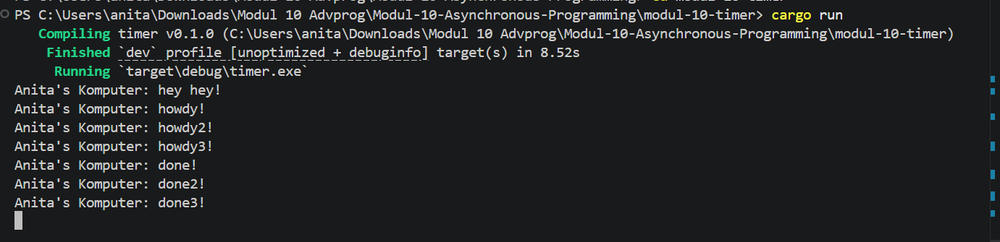

## Tutorial 2: Broadcast Chat
### Eksperimen 2.1: Original Code, and How it Run
#### Hasil Eksekusi Terminal
#### Analisis dan Penjelasan

Program ini mengimplementasikan aplikasi *broadcast chat* berbasis protokol WebSocket menggunakan bahasa Rust dan pustaka asinkronus `tokio`. Terdapat dua komponen utama eksekusi, yaitu komponen `server` dan komponen `client`.

Secara default, server berjalan dan mendengarkan koneksi masuk pada port `2000`. Setiap kali ada client baru yang terhubung, server akan menangani koneksinya secara asinkronus. Ketika salah satu client mengirimkan sebuah pesan teks, server akan menerima pesan tersebut dan memanfaatkaan mekanisme `broadcast channel` bawaan `tokio` untuk menyebarkan (*broadcast*) pesan tersebut ke seluruh client yang saat itu sedang terhubung, termasuk dikirimkan kembali ke sisi client pengirim itu sendiri.

**Cara Menjalankan:**

1. Jalankan komponen server utama: `cargo run --bin server`
2. Buka terminal baru, jalankan komponen client pertama: `cargo run --bin client`
3. Buka beberapa terminal baru lainnya untuk menambahkan client tambahan.

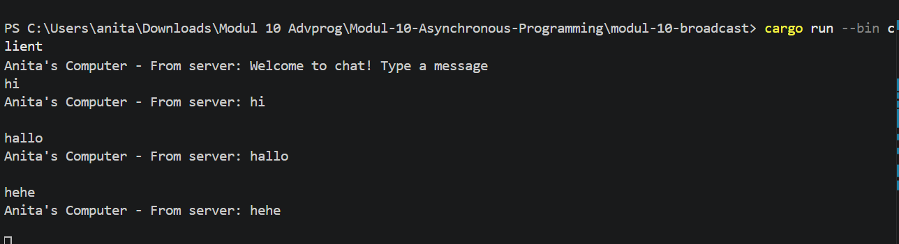
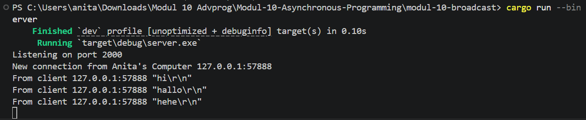

### Eksperimen 2.2: Modifying Port
#### Hasil Eksekusi Terminal
#### Analisis dan Penjelasan

Pada eksperimen ini, dilakukan modifikasi untuk mengubah port komunikasi WebSocket default yang semula berada pada port `2000` menjadi port baru yaitu `8080`. Karena arsitektur WebSocket melibatkan komunikasi dua arah antara penyedia layanan (*server*) dan pengguna (*client*), perubahan port wajib dilakukan pada kode sumber kedua komponen tersebut sekaligus.

Pada berkas `src/bin/server.rs`, baris pengikatan alamat diubah:

```rust
let listener = TcpListener::bind("127.0.0.1:2000").await?;
// Menjadi:
let listener = TcpListener::bind("127.0.0.1:8080").await?;

```

Pada berkas `src/bin/client.rs`, baris inisialisasi URI tujuan diubah:

```rust
ClientBuilder::from_uri(http::Uri::from_static("ws://127.0.0.1:2000"))
// Menjadi:
ClientBuilder::from_uri(http::Uri::from_static("ws://127.0.0.1:8080"))

```

Kedua sisi harus menggunakan port yang identik agar jabat tangan (*handshake*) protokol WebSocket dapat terjalin dengan sukses. Jika terdapat ketidakcocokan konfigurasi port pada salah satu komponen, koneksi akan langsung gagal dan memicu eror `ConnectionRefused`. Protokol yang digunakan tetap berupa `ws://` (WebSocket standar). Setelah port diselaraskan menjadi `8080`, fungsionalitas pengiriman pesan real-time kembali berjalan normal tanpa kendala.

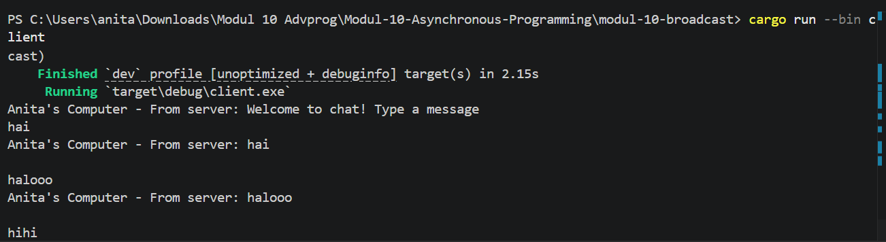
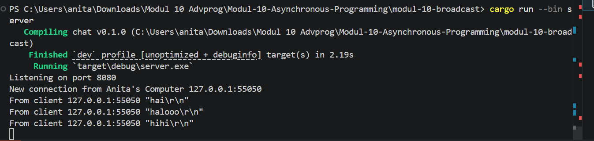

### Eksperimen 2.3: Small Changes, Add IP and Port
#### Hasil Eksekusi Terminal
#### Analisis dan Penjelasan

**1. Apa yang Diubah?**
Modifikasi kecil dilakukan pada sisi server untuk meningkatkan transparansi informasi pesan. Jika sebelumnya server hanya meneruskan string teks mentah dari pengirim langsung ke seluruh client, sekarang server dikonfigurasi untuk menyisipkan informasi identitas berupa alamat IP (*IP Address*) dan nomor port asal dari client pengirim ke dalam setiap pesan yang disebarkan.

**2. Lokasi Perubahan Kode**
Perubahan diterapkan pada berkas `src/bin/server.rs` di dalam fungsi penanganan koneksi `handle_connection`.

*Sebelum Diubah:*

```rust
if let Some(text) = msg.as_text() {
    println!("From client {addr:?} {text:?}");
    bcast_tx.send(text.to_string()).unwrap();
}

```

*Sesudah Diubah:*

```rust
if let Some(text) = msg.as_text() {
    println!("From client {addr:?} {text:?}");
    bcast_tx.send(format!("From {addr}: {text}")).unwrap();
}

```

Modifikasi memanfaatkan makro `format!` untuk menyatukan variabel alamat `addr` (bertipe `SocketAddr`) dengan isi teks pesan.

**3. Mengapa Perubahan Dilakukan di Sisi Server?**
Sebab hanya server yang memegang kendali penuh atas informasi metadata koneksi jaringan (`SocketAddr`) dari masing-masing klien yang masuk melalui fungsi `accept()`. Sisi client individu tidak memiliki akses informasi maupun interaksi langsung dengan client lainnya karena seluruh lalu lintas komunikasi dimediasi penuh oleh server pusat melalui broadcast channel. Oleh karena itu, penataan format informasi pengirim paling tepat diolah oleh server sebelum pesan disebarluaskan ke seluruh pelanggan (*subscribers*).

**4. Alur Hasil Eksekusi Baru**
Saat client mengirim pesan (misal: `"halo"`), server akan menangkapnya, mencetak log internal pada terminal server, lalu membungkusnya menjadi bentuk `From 127.0.0.1:PORT: halo`. Ketika pesan tersebut sampai di terminal seluruh klien, sistem akan mencetak teks dengan format penanda komputer pribadi: `Anita's Computer - From server: From 127.0.0.1:PORT: halo`. Hal ini membuat jalannya percakapan berkelompok menjadi lebih terstruktur dan tidak anonim.

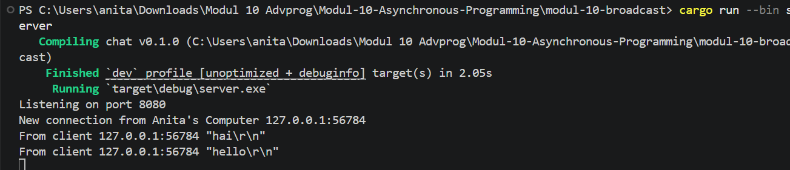
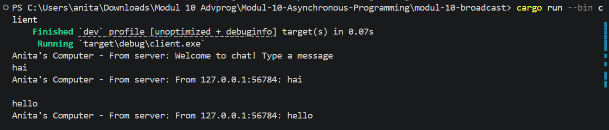

# Tutorial 3 - WebChat

## Experiment 3.1: Original Code

### Deskripsi Tugas

Eksperimen kali ini berfokus pada eksekusi kode awal (*original code*) dari YewChat, sebuah platform obrolan berbasis web (*browser*) yang dirancang menggunakan bahasa Rust melalui framework **Yew**. Berbeda dengan eksperimen pada modul sebelumnya yang beroperasi di lingkungan CLI/terminal, implementasi kali ini menyajikan antarmuka grafis obrolan (*graphical chat interface*) yang jauh lebih modern, interaktif, dan reaktif.

Arsitektur sistem ini dibangun atas dua komponen utama yang saling terhubung:
- **SimpleWebsocketServer**: Backend server berbasis Node.js yang bertugas menangani siklus hidup koneksi WebSocket serta mendistribusikan (*broadcast*) pesan antar pengguna yang aktif.
- **YewChat**: Aplikasi frontend berbasis Rust yang dikompilasi menjadi dokumen biner *WebAssembly* (WASM) agar dapat dieksekusi secara optimal langsung di dalam browser.

---

### Penanganan Kendala Sinkronisasi Lingkungan (Setup)

Dalam proses instalasi, ditemukan isu kompatibilitas di mana proyek YewChat masih mengandalkan pustaka `wasm-bindgen` versi lawas (0.2.45), sehingga memicu kegagalan kompilasi jika dijalankan menggunakan kompilator Rust *stable* terbaru. Guna mengatasi hambatan tersebut, diperlukan konfigurasi *toolchain* khusus dengan menurunkan versi kompiler ke Rust **1.77.0** selama proses pengerjaan YewChat berlangsung.

```powershell
rustup toolchain install 1.77.0
rustup default 1.77.0

```

Setelah seluruh proses kompilasi dan pengujian selesai dilakukan, repositori lokal dapat dikembalikan ke konfigurasi standar agar tidak mengganggu fungsionalitas proyek Rust lainnya:

```powershell
rustup default stable

```

---

### Prosedur Menjalankan Aplikasi

#### Terminal 1 — Inisialisasi Backend WebSocket Server

```powershell
cd tutorial3-webchat\tutorial3-webchat-server
npm i
npm start

```

Log Keluaran Terminal:

```
Listening on port 8080

```

#### Terminal 2 — Kompilasi & Penayangan Frontend YewChat

```powershell
rustup default 1.77.0
cd tutorial3-webchat\tutorial3-webchat
npm i
npm start

```

Log Keluaran Terminal:

```
[webpack-dev-server] Loopback: http://localhost:8000/

```

Setelah kedua komponen aktif, aplikasi dapat diakses dengan membuka alamat `http://localhost:8000` melalui browser.

---

### Mekanisme Kerja Sistem

Sistem navigasi antarmuka pada aplikasi ini dikelola secara asinkronus oleh pustaka `yew_router` yang membagi alur menjadi dua segmen rute utama:

* Rute `/` → Mengarah ke panel Autentikasi/Login
* Rute `/chat` → Mengarah ke ruang obrolan (*Chat Room*)

Alur pertukaran datanya dijabarkan sebagai berikut:

1. Pengguna memuat alamat `http://localhost:8000` pada browser, lalu sistem akan menyajikan halaman utama (login).
2. Pengguna memasukkan identitas berupa *username* unik dan menekan tombol aksi **GO CHATTING!**.
3. Aplikasi web secara asinkronus mengirimkan muatan data registrasi menuju server backend dalam representasi objek JSON:
```json
{"messageType": "register", "data": "Anita"}

```


4. Server memproses muatan tersebut, mencatat sesi, dan mengirimkan balik daftar nama pengguna lain yang tengah berstatus *online*.
5. Pengguna mengetikkan pesan teks pada area input yang disediakan, lalu mengirimkannya lewat soket jaringan.
6. Server menangkap aliran data teks tersebut, kemudian menyebarkannya kembali (*broadcast*) ke setiap socket klien yang terdaftar di jaringan.
7. Aplikasi pada sisi klien menerima sebaran pesan tersebut dan merendernya ke dalam panel obrolan secara *real-time*.

Sinkronisasi data antar komponen internal framework Yew dijembatani oleh arsitektur `EventBus` dari pustaka `yew_agent`. Mekanisme ini memastikan setiap aliran data yang diterima dari protokol WebSocket dapat diteruskan ke komponen tampilan obrolan secara reaktif dan instan.

---

### Hasil Observasi Antarmuka

* Panel autentikasi (login) berhasil dimuat dengan dominasi estetika visual bertema gelap (*dark mode*), dilengkapi kolom input teks nama serta tombol aksi **GO CHATTING!**.
* Begitu proses login divalidasi, pengguna otomatis diarahkan ke ruang obrolan yang memuat bilah menu (*sidebar*) khusus bernama **Users** di sisi kiri layar.
* Representasi visual berupa gambar profil (*avatar*) pengguna dibuat secara dinamis menggunakan integrasi layanan pihak ketiga, yaitu DiceBear API, yang mengolah nilai string *username* menjadi visual unik.
* Setiap entitas pengguna yang terhubung membawa teks status bawaan bertuliskan **"Hi there!"** tepat di bawah baris nama mereka.
* Seluruh pesan yang terkirim terstruktur dengan rapi di dalam komponen *chat box*, lengkap dengan penanda waktu, identitas nama pengirim, beserta ikon avatarnya.
* Area input pengetikan pesan diletakkan secara ergonomis di batas bawah layar, berdampingan dengan tombol kirim berwujud lingkaran ikonik.


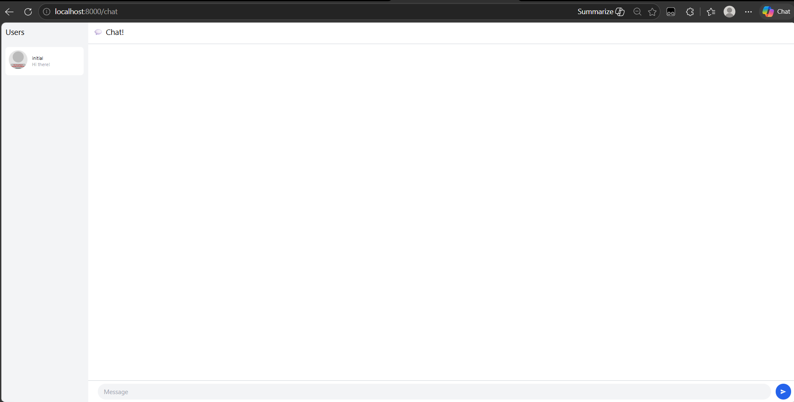
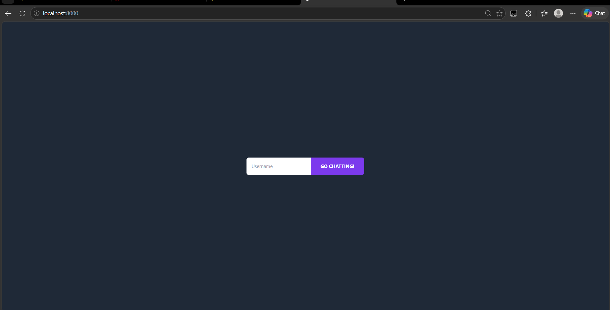